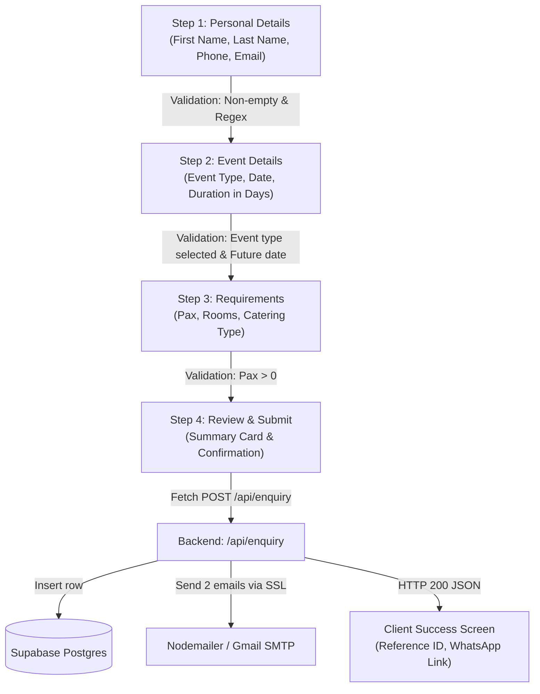

# Phase 5 & Phase 6 — Data, Content Layer & Business Logic

---

## Phase 5: Data and Content Layer

### 5.1 Content & Constants Inventory

Every configuration and data file in `constants/` and `lib/` is audited below:

#### 1. [constants/site.ts](file:///d:/APP/Vanrai-Updated/Vanrai-Villlage/constants/site.ts)
- **What it holds:**
  - `SITE_NAME = "Vanrai Resort"`
  - `SITE_TAGLINE = "Nature Resort with Luxury Wooden Cottages & Agro-Tourism Stays"`
  - `SITE_DESCRIPTION = "Escape to Vanrai Resort near Ahmednagar..."`
  - `SITE_URL = process.env.NODE_ENV === "production" ? "https://vanrairesort.com" : (process.env.NEXT_PUBLIC_SITE_URL || "http://localhost:3000")`
  - `SITE_PHONE = "+919730001579"`, `SITE_PHONE_DISPLAY = "+91 97300 01579"`
  - `SITE_EMAIL = "vanrai_resort@yahoo.co.in"`
  - `SOCIAL_LINKS = { instagram, facebook, youtube }`
  - `SITE_LOCATION = { full, street, locality, region, postalCode, country, geo: { latitude: 19.1383, longitude: 74.7214 } }`
- **Who imports it:**
  - [app/layout.tsx:7](file:///d:/APP/Vanrai-Updated/Vanrai-Villlage/app/layout.tsx#L7) (metadataBase, title template, openGraph)
  - [app/page.tsx:9](file:///d:/APP/Vanrai-Updated/Vanrai-Villlage/app/page.tsx#L9) (JSON-LD schema, metadata)
  - [app/stays/page.tsx:3](file:///d:/APP/Vanrai-Updated/Vanrai-Villlage/app/stays/page.tsx#L3) (metadata, breadcrumbs)
  - [app/experiences/page.tsx:3](file:///d:/APP/Vanrai-Updated/Vanrai-Villlage/app/experiences/page.tsx#L3) & [app/experiences/[id]/page.tsx:5](file:///d:/APP/Vanrai-Updated/Vanrai-Villlage/app/experiences/%5Bid%5D/page.tsx#L5)
  - [app/events/page.tsx:3](file:///d:/APP/Vanrai-Updated/Vanrai-Villlage/app/events/page.tsx#L3) & [app/events/[slug]/page.tsx:5](file:///d:/APP/Vanrai-Updated/Vanrai-Villlage/app/events/%5Bslug%5D/page.tsx#L5)
  - [app/about/page.tsx:3](file:///d:/APP/Vanrai-Updated/Vanrai-Villlage/app/about/page.tsx#L3), [app/gallery/page.tsx:3](file:///d:/APP/Vanrai-Updated/Vanrai-Villlage/app/gallery/page.tsx#L3), [app/membership/page.tsx:3](file:///d:/APP/Vanrai-Updated/Vanrai-Villlage/app/membership/page.tsx#L3), [app/contact/page.tsx:3](file:///d:/APP/Vanrai-Updated/Vanrai-Villlage/app/contact/page.tsx#L3), [app/privacy-policy/page.tsx:3](file:///d:/APP/Vanrai-Updated/Vanrai-Villlage/app/privacy-policy/page.tsx#L3), [app/terms/page.tsx:3](file:///d:/APP/Vanrai-Updated/Vanrai-Villlage/app/terms/page.tsx#L3)
  - [app/sitemap.ts:2](file:///d:/APP/Vanrai-Updated/Vanrai-Villlage/app/sitemap.ts#L2), [app/robots.ts:2](file:///d:/APP/Vanrai-Updated/Vanrai-Villlage/app/robots.ts#L2)

#### 2. [constants/pricing.ts](file:///d:/APP/Vanrai-Updated/Vanrai-Villlage/constants/pricing.ts)
- **What it holds:**
  - `WOODEN_COTTAGE_PRICE_PER_NIGHT = 4000`
  - `DELUXE_AC_ROOM_PRICE_PER_NIGHT = 3500`
  - `STANDARD_ROOM_PRICE_PER_NIGHT = 2500`
  - `formatINR(amount: number): string` (formats as `₹4,000` using `Intl.NumberFormat("en-IN")`)
- **Who imports it:**
  - [app/page.tsx:10](file:///d:/APP/Vanrai-Updated/Vanrai-Villlage/app/page.tsx#L10) (pricing in metadata & JSON-LD)
  - [app/stays/page.tsx:4](file:///d:/APP/Vanrai-Updated/Vanrai-Villlage/app/stays/page.tsx#L4) (pricing in metadata & OG tags)
  - [lib/stays-data.ts:7](file:///d:/APP/Vanrai-Updated/Vanrai-Villlage/lib/stays-data.ts#L7) (assigns cottage rate)
  - [app/availability/availability-client.tsx:13](file:///d:/APP/Vanrai-Updated/Vanrai-Villlage/app/availability/availability-client.tsx#L13)

#### 3. [lib/contact-config.ts](file:///d:/APP/Vanrai-Updated/Vanrai-Villlage/lib/contact-config.ts)
- **What it holds:**
  - `RESORT_CONTACT`: Object with `phoneDisplay` (`+91 97300 01579`), `phoneRaw` (`919730001579`), `phoneTel` (`tel:+919730001579`), `whatsAppNumber` (`919730001579`), `whatsAppBaseUrl` (`https://wa.me/919730001579`), `emailAddress` (`vanrai_resort@yahoo.co.in`), `address`, and `socials`.
  - `getWhatsAppUrl(message?: string): string`: Returns URL-encoded WhatsApp link with pre-filled message text.
  - `WHATSAPP_MESSAGES`: Dictionary of pre-filled messages for general, stay, room, events, dining, experience, and membership inquiries.
- **Who imports it:**
  - [components/ui/floating-whatsapp.tsx:5](file:///d:/APP/Vanrai-Updated/Vanrai-Villlage/components/ui/floating-whatsapp.tsx#L5)
  - [components/ui/footer.tsx:19](file:///d:/APP/Vanrai-Updated/Vanrai-Villlage/components/ui/footer.tsx#L19)
  - [components/ui/contact-form-stepper.tsx:12](file:///d:/APP/Vanrai-Updated/Vanrai-Villlage/components/ui/contact-form-stepper.tsx#L12)
  - [lib/email.ts:2](file:///d:/APP/Vanrai-Updated/Vanrai-Villlage/lib/email.ts#L2)
  - [app/stays/stays-client.tsx:17](file:///d:/APP/Vanrai-Updated/Vanrai-Villlage/app/stays/stays-client.tsx#L17)
  - [app/experiences/[id]/experience-detail-client.tsx:11](file:///d:/APP/Vanrai-Updated/Vanrai-Villlage/app/experiences/%5Bid%5D/experience-detail-client.tsx#L11)
  - [app/availability/availability-client.tsx:12](file:///d:/APP/Vanrai-Updated/Vanrai-Villlage/app/availability/availability-client.tsx#L12)
  - [app/book/book-client.tsx:9](file:///d:/APP/Vanrai-Updated/Vanrai-Villlage/app/book/book-client.tsx#L9)

#### 4. [lib/stays-data.ts](file:///d:/APP/Vanrai-Updated/Vanrai-Villlage/lib/stays-data.ts)
- **What it holds:**
  - `ROOMS_DATA`: Array of 3 room definitions (`wooden-cottage`, `deluxe-ac`, `standard-room`) containing taglines, descriptions, prices, capacities, bed types, bathroom types, amenities, photos, and package inclusions.
  - `RESORT_PRIVILEGES`: 6 core privileges (Swimming pool, pure-veg dining, 2.5-acre agro-sanctuary, sports turf, 24/7 security, stargazing).
  - `STAY_POLICIES`: 7 stay policies (Check-in 12:00 PM / Check-out 10:00 AM, breakfast policy, pool guidelines, extra mattress ₹800, 50% deposit, cancellation terms, ID proof).
- **Who imports it:**
  - [components/ui/stays-section.tsx](file:///d:/APP/Vanrai-Updated/Vanrai-Villlage/components/ui/stays-section.tsx)
  - [app/stays/stays-client.tsx](file:///d:/APP/Vanrai-Updated/Vanrai-Villlage/app/stays/stays-client.tsx)
  - [components/stays/room-showcase-card.tsx](file:///d:/APP/Vanrai-Updated/Vanrai-Villlage/components/stays/room-showcase-card.tsx)
  - [components/stays/stays-comparison.tsx](file:///d:/APP/Vanrai-Updated/Vanrai-Villlage/components/stays/stays-comparison.tsx)
  - [components/stays/stays-privileges.tsx](file:///d:/APP/Vanrai-Updated/Vanrai-Villlage/components/stays/stays-privileges.tsx)
  - [components/stays/stays-policies.tsx](file:///d:/APP/Vanrai-Updated/Vanrai-Villlage/components/stays/stays-policies.tsx)

#### 5. [lib/experiences-data.ts](file:///d:/APP/Vanrai-Updated/Vanrai-Villlage/lib/experiences-data.ts)
- **What it holds:**
  - `EXPERIENCES_DATA`: Record of 13 experience objects (`bonfire`, `candle-light`, `rain-dance`, `waterpark`, `dining`, `weddings`, `picnics`, `birthdays`, `anniversary`, `yoga`, `sports`, `indoor`, `kids-zone`).
- **Who imports it:**
  - [components/ui/experiences-section.tsx](file:///d:/APP/Vanrai-Updated/Vanrai-Villlage/components/ui/experiences-section.tsx)
  - [app/experiences/experiences-client.tsx](file:///d:/APP/Vanrai-Updated/Vanrai-Villlage/app/experiences/experiences-client.tsx)
  - [app/experiences/[id]/page.tsx](file:///d:/APP/Vanrai-Updated/Vanrai-Villlage/app/experiences/%5Bid%5D/page.tsx)
  - [app/experiences/[id]/experience-detail-client.tsx](file:///d:/APP/Vanrai-Updated/Vanrai-Villlage/app/experiences/%5Bid%5D/experience-detail-client.tsx)

#### 6. [lib/events-data.ts](file:///d:/APP/Vanrai-Updated/Vanrai-Villlage/lib/events-data.ts)
- **What it holds:**
  - `EVENT_DATA`: Record of 4 event categories (`wedding`, `festive`, `corporate`, `experiential`) with timeline, package pricing, gallery images, and highlights.
- **Who imports it:**
  - [app/events/events-client.tsx](file:///d:/APP/Vanrai-Updated/Vanrai-Villlage/app/events/events-client.tsx)
  - [app/events/[slug]/page.tsx](file:///d:/APP/Vanrai-Updated/Vanrai-Villlage/app/events/%5Bslug%5D/page.tsx)
  - [app/events/[slug]/event-detail-client.tsx](file:///d:/APP/Vanrai-Updated/Vanrai-Villlage/app/events/%5Bslug%5D/event-detail-client.tsx)

#### 7. [lib/supabase.ts](file:///d:/APP/Vanrai-Updated/Vanrai-Villlage/lib/supabase.ts)
- **What it holds:**
  - `isSupabaseConfigured()`: Checks if `NEXT_PUBLIC_SUPABASE_URL` and keys are present.
  - `getSupabaseClient()`: Cached server-side Supabase client factory.
  - `EventEnquiryRecord`: TypeScript interface representing a row in `event_enquiries`.
- **Who imports it:**
  - [app/api/enquiry/route.ts:3](file:///d:/APP/Vanrai-Updated/Vanrai-Villlage/app/api/enquiry/route.ts#L3)

#### 8. [lib/email.ts](file:///d:/APP/Vanrai-Updated/Vanrai-Villlage/lib/email.ts)
- **What it holds:**
  - `createTransporter()`: Nodemailer instance connected to Gmail SMTP SSL (port 465).
  - `getAdminEmailHtml()`: Generates responsive luxury dark HTML email for the resort admin.
  - `getCustomerEmailHtml()`: Generates branded acknowledgment email for the guest.
  - `sendEnquiryEmails()`: Dispatches both emails concurrently via `Promise.allSettled`.
- **Who imports it:**
  - [app/api/enquiry/route.ts:4](file:///d:/APP/Vanrai-Updated/Vanrai-Villlage/app/api/enquiry/route.ts#L4)

---

### 5.2 Content Management & How to Edit Content

Because the project does not connect to a headless CMS (Sanity, Strapi, Contentful), all content is managed directly via static TypeScript files:

| Content Area | Primary File Location | How to Edit / Add Items |
| :--- | :--- | :--- |
| **Room Stays & Pricing** | [lib/stays-data.ts](file:///d:/APP/Vanrai-Updated/Vanrai-Villlage/lib/stays-data.ts) & [constants/pricing.ts](file:///d:/APP/Vanrai-Updated/Vanrai-Villlage/constants/pricing.ts) | Edit room objects in `ROOMS_DATA`. Update prices in `constants/pricing.ts`. (Remember to sync `ROOM_INVENTORY_DATA` in `availability-client.tsx`). |
| **Experiences & Activities** | [lib/experiences-data.ts](file:///d:/APP/Vanrai-Updated/Vanrai-Villlage/lib/experiences-data.ts) | Add a new key to `EXPERIENCES_DATA`. Next.js `generateStaticParams()` will automatically create the `/experiences/[id]` route on the next build. *(Remember to add the new route to `app/sitemap.ts`)*. |
| **Events & Weddings** | [lib/events-data.ts](file:///d:/APP/Vanrai-Updated/Vanrai-Villlage/lib/events-data.ts) | Add or edit keys in `EVENT_DATA` (timelines, package tiers, pricing text). |
| **Privilege Club Plans** | [components/membership/membership-plans.tsx](file:///d:/APP/Vanrai-Updated/Vanrai-Villlage/components/membership/membership-plans.tsx) | Edit the `plans` array in `membership-plans.tsx` (pricing, inclusions, terms). |
| **Gallery Photos** | [app/gallery/gallery-client.tsx](file:///d:/APP/Vanrai-Updated/Vanrai-Villlage/app/gallery/gallery-client.tsx) & [components/ui/gallery-section.tsx](file:///d:/APP/Vanrai-Updated/Vanrai-Villlage/components/ui/gallery-section.tsx) | Add photo objects `{ id, src, alt, category, title }` in the local array. |
| **Guest Testimonials** | [components/ui/testimonials-section.tsx](file:///d:/APP/Vanrai-Updated/Vanrai-Villlage/components/ui/testimonials-section.tsx) | Edit or add review items in the `testimonials` array (lines 35-115). |
| **Phone / Email / Address** | [constants/site.ts](file:///d:/APP/Vanrai-Updated/Vanrai-Villlage/constants/site.ts) & [lib/contact-config.ts](file:///d:/APP/Vanrai-Updated/Vanrai-Villlage/lib/contact-config.ts) | **ATTENTION:** Both files currently store contact information and must be updated together to avoid divergence. |

---

### 5.3 Single Sources of Truth vs. Duplicated Values

A key finding of this code audit is several subtle data duplications and discrepancies across files:

1. **Contact Information Duplication:**
   - [constants/site.ts:18-38](file:///d:/APP/Vanrai-Updated/Vanrai-Villlage/constants/site.ts#L18-L38) defines `SITE_PHONE`, `SITE_EMAIL`, `SITE_LOCATION`, and `SOCIAL_LINKS`.
   - [lib/contact-config.ts:6-31](file:///d:/APP/Vanrai-Updated/Vanrai-Villlage/lib/contact-config.ts#L6-L31) defines `RESORT_CONTACT.phoneDisplay`, `phoneRaw`, `emailAddress`, `address`, and `socials`.
   - *Risk:* If a phone number or email address changes, both files must be edited.

2. **Room Pricing Duplication & Hardcoding:**
   - [constants/pricing.ts:6-8](file:///d:/APP/Vanrai-Updated/Vanrai-Villlage/constants/pricing.ts#L6-L8) defines:
     - `WOODEN_COTTAGE_PRICE_PER_NIGHT = 4000`
     - `DELUXE_AC_ROOM_PRICE_PER_NIGHT = 3500`
     - `STANDARD_ROOM_PRICE_PER_NIGHT = 2500`
   - In [lib/stays-data.ts:59-207](file:///d:/APP/Vanrai-Updated/Vanrai-Villlage/lib/stays-data.ts#L59-L207):
     - Wooden Cottage imports and uses `WOODEN_COTTAGE_PRICE_PER_NIGHT`.
     - Deluxe AC room **hardcodes `price: 3500`** instead of importing `DELUXE_AC_ROOM_PRICE_PER_NIGHT`.
     - Standard Room **hardcodes `price: 2500`** instead of importing `STANDARD_ROOM_PRICE_PER_NIGHT`.
   - In [app/availability/availability-client.tsx:15-55](file:///d:/APP/Vanrai-Updated/Vanrai-Villlage/app/availability/availability-client.tsx#L15-L55):
     - `ROOM_INVENTORY_DATA` defines its own room array with hardcoded prices (`price: 3500`, `price: 2500`) instead of importing from `constants/pricing.ts` or `lib/stays-data.ts`.

3. **Extra Guest Rate Mismatch:**
   - In [lib/stays-data.ts:326](file:///d:/APP/Vanrai-Updated/Vanrai-Villlage/lib/stays-data.ts#L326), `STAY_POLICIES` states:
     `"...an extra mattress with bedding and amenities is available at ₹800 per night."`
   - In [lib/booking-context.tsx:88](file:///d:/APP/Vanrai-Updated/Vanrai-Villlage/lib/booking-context.tsx#L88), `calculateRoomsAndCharges()` sets:
     `extraCharge = 1000;`
   - *Discrepancy:* The policy text quotes **₹800/night**, but the booking engine calculation bills **₹1,000/night**.

4. **Checkout Timing Discrepancy:**
   - In [lib/stays-data.ts:310](file:///d:/APP/Vanrai-Updated/Vanrai-Villlage/lib/stays-data.ts#L310) and [app/terms/terms-client.tsx:75](file:///d:/APP/Vanrai-Updated/Vanrai-Villlage/app/terms/terms-client.tsx#L75), policies specify **Check-out is by 10:00 AM**.
   - In [app/page.tsx:74](file:///d:/APP/Vanrai-Updated/Vanrai-Villlage/app/page.tsx#L74), JSON-LD structured data specifies `checkoutTime: "11:00"`.

5. **Hardcoded Fallback Email in Transporter:**
   - In [lib/email.ts:23](file:///d:/APP/Vanrai-Updated/Vanrai-Villlage/lib/email.ts#L23):
     `const senderAddress = process.env.SMTP_USER || "vikrammhaske5743@gmail.com";`
   - A personal Gmail address is hardcoded as the fallback sender if `SMTP_USER` is undefined.

---

## Phase 6: Booking Flow, Forms & Business Logic

### 6.1 End-to-End Room Booking Journey

The room reservation flow operates across 5 discrete steps:

```mermaid
graph TD
    A["Homepage Hero / Stays Page<br/>(BookingBar Widget)"] -->|User inputs CheckIn, CheckOut, Guests| B["/availability<br/>(AvailabilityClient)"]
    B -->|Selects Rooms & Add-ons<br/>Stored in in-memory BookingContext| C["/booking/details<br/>(GuestDetailsClient)"]
    C -->|Fills Name, Email, Phone<br/>Simulated OTP Verification (1234)| D["/booking/payment<br/>(PaymentClient)"]
    D -->|Selects UPI/Card/Netbanking<br/>Simulated 2000ms delay| E["/booking/confirmation<br/>(ConfirmationClient)"]
    E -->|Confetti burst, random VR-ID,<br/>Displays in-memory booking total| F["End Journey<br/>(No DB write, No Email)"]
```

#### Step 1: Search & Date Selection ([components/ui/booking-bar.tsx](file:///d:/APP/Vanrai-Updated/Vanrai-Villlage/components/ui/booking-bar.tsx))
- User interacts with the floating `<BookingBar />` located in the hero or on `/availability`.
- Fields:
  - **Check-in Date:** Selected via `react-day-picker` popup. Disabled for dates prior to today.
  - **Check-out Date:** Selected via `react-day-picker` popup. Must be $\ge$ Check-in date.
  - **Guests:** Counter for Adults (defaults to 2) and Children (defaults to 0).
  - **Room Category:** Dropdown (`All`, `Wooden Cottage`, `Deluxe AC Room`, `Standard Room`).
- Action: Clicks "Check Availability". Navigates via `router.push("/availability?checkIn=...&checkOut=...&adults=...&children=...&roomType=...")`.

#### Step 2: Room Selection & Inventory ([app/availability/availability-client.tsx](file:///d:/APP/Vanrai-Updated/Vanrai-Villlage/app/availability/availability-client.tsx))
- Reads URL query parameters on mount and updates `BookingContext` state ([lines 96-110](file:///d:/APP/Vanrai-Updated/Vanrai-Villlage/app/availability/availability-client.tsx#L96-L110)).
- Displays 3 inventory cards from `ROOM_INVENTORY_DATA`:
  - **Wooden Cottages:** Total: 3, Booked: 1 (2 Available). Price: ₹4,000.
  - **Deluxe AC Rooms:** Total: 10, Booked: 8 (2 Available). Price: ₹3,500.
  - **Standard Rooms:** Total: 5, Booked: 5 (**Sold Out** banner displayed, buttons disabled).
- User clicks `+` to add rooms to `state.selectedRooms`.
- Add-ons section allows toggling:
  - Candle Light Dinner (+₹1,500)
  - Evening Bonfire Setup (+₹800)
  - Barbeque Grill Kit (+₹1,200)
- Promo Code input:
  - Entering `WELCOME20` applies a 20% discount.
  - Entering `FLAT500` applies a 10% discount.
- Privilege Club Membership ID:
  - Entering any string containing `VANRAI` (e.g. `VANRAI-VIP`) triggers mock verification and applies a 10% discount.
- User clicks "Continue to Guest Details". Validates `state.selectedRooms.length > 0`, then executes `router.push("/booking/details")`.

#### Step 3: Guest Details & OTP Simulation ([app/booking/details/details-client.tsx](file:///d:/APP/Vanrai-Updated/Vanrai-Villlage/app/booking/details/details-client.tsx))
- Form collects:
  - Full Name (`text`)
  - Email (`email`)
  - Mobile Number (`tel`, 10 digits)
  - Government ID Type (`Aadhar Card`, `Passport`, `Driving License`, `Voter ID`)
  - ID Number (`text`)
  - Physical Address (`textarea`)
  - Special Requests (`textarea`)
- Mobile OTP Verification Simulation ([lines 35-55](file:///d:/APP/Vanrai-Updated/Vanrai-Villlage/app/booking/details/details-client.tsx#L35-L55)):
  - Clicking "Verify Mobile" triggers browser `alert("OTP Sent to ... (Simulated: 1234)")`.
  - An inline OTP box opens. Entering `1234` sets `isOtpVerified = true` and displays green "Verified" badge.
- Validation: Requires `isOtpVerified && formData.fullName && formData.email`.
- **Architectural Discovery:** `formData` is stored purely in local React `useState`. It is **not** passed to `BookingContext`, not saved to `sessionStorage`, and not appended to URL params.
- Clicks "Proceed to Payment" $\rightarrow$ `router.push("/booking/payment")`.

#### Step 4: Checkout & Payment Simulation ([app/booking/payment/payment-client.tsx](file:///d:/APP/Vanrai-Updated/Vanrai-Villlage/app/booking/payment/payment-client.tsx))
- Renders order summary with breakdown (room total, nights, extra guest fees, add-ons, discounts, and final total).
- Offers payment tabs: UPI, Credit/Debit Card, and Netbanking.
- UPI tab allows entering UPI ID; clicking verify validates if the string includes `"@"`.
- Clicking "Pay Now" executes [lines 29-34](file:///d:/APP/Vanrai-Updated/Vanrai-Villlage/app/booking/payment/payment-client.tsx#L29-L34):
  ```typescript
  const handlePayment = () => {
    setIsProcessing(true);
    setTimeout(() => {
      router.push("/booking/confirmation");
    }, 2000);
  };
  ```
- **No payment gateway (Razorpay, Stripe, Paytm) is executed.**

#### Step 5: Confirmation ([app/booking/confirmation/confirmation-client.tsx](file:///d:/APP/Vanrai-Updated/Vanrai-Villlage/app/booking/confirmation/confirmation-client.tsx))
- Triggers 3 seconds of `canvas-confetti` celebration.
- Generates random client-side reference ID: `"VR-" + Math.random().toString(36).substring(2, 8).toUpperCase()`.
- Renders summary of booked room names, check-in/out dates, guest count, and final total pulled from `useBooking()`.
- **No database row is inserted and no confirmation email is triggered.** If the user refreshes the page, `BookingContext` reinitializes to defaults.

---

### 6.2 State Management Architecture

State is managed by **`BookingProvider`** in [lib/booking-context.tsx](file:///d:/APP/Vanrai-Updated/Vanrai-Villlage/lib/booking-context.tsx), wrapped globally at [app/layout.tsx:84](file:///d:/APP/Vanrai-Updated/Vanrai-Villlage/app/layout.tsx#L84).

#### `BookingState` Interface ([lib/booking-context.tsx:20-34](file:///d:/APP/Vanrai-Updated/Vanrai-Villlage/lib/booking-context.tsx#L20-L34))
```typescript
export interface BookingState {
  checkIn: string;
  checkOut: string;
  adults: number;
  children: number;
  roomType: RoomType;
  roomsNeeded: number;
  extraGuestCharge: number;
  selectedRooms: SelectedRoom[];
  membershipId: string;
  isMembershipVerified: boolean;
  promoCode: string;
  promoDiscount: number;
  addOns: AddOn[];
}
```

#### Persistence Audit
- **`localStorage`:** **None.**
- **`sessionStorage`:** **None.**
- **URL Parameters:** Used only between `<BookingBar />` and `/availability`.
- **State Lifetime:** Exists in React memory during client SPA transitions. A full page reload (F5 / hard refresh) wipes all selections, resetting `adults: 2, children: 0, selectedRooms: []`.

---

### 6.3 Pricing, Night Calculation & Extra Guest Logic

Implemented in `calculateTotal()` and `calculateRoomsAndCharges()` ([lib/booking-context.tsx:79-117](file:///d:/APP/Vanrai-Updated/Vanrai-Villlage/lib/booking-context.tsx#L79-L117)):

1. **Night Calculation:**
   $$\text{diffTime} = |\text{CheckOut} - \text{CheckIn}|$$
   $$\text{nights} = \lceil \frac{\text{diffTime}}{1000 \times 60 \times 60 \times 24} \rceil \quad (\text{defaults to } 1)$$

2. **Rooms Needed & Extra Guest Charge:**
   - If $\text{adults} \le 2 \implies \text{rooms} = 1, \text{extraGuestCharge} = ₹0$
   - If $\text{adults} == 3 \implies \text{rooms} = 1, \text{extraGuestCharge} = ₹1,000$
   - If $\text{adults} > 3 \implies \text{rooms} = \lceil \frac{\text{adults}}{2} \rceil, \text{extraGuestCharge} = ₹0$

3. **Subtotal & Discounts:**
   $$\text{roomsTotal} = \sum (\text{room.price} \times \text{room.count})$$
   $$\text{subtotal} = (\text{roomsTotal} \times \text{nights}) + (\text{extraGuestCharge} \times \text{nights}) + \text{addOnsTotal}$$
   $$\text{membershipDiscount} = \text{isMembershipVerified} \ ? \ (\text{subtotal} \times 0.10) : 0$$
   $$\text{promoDiscount} = \text{subtotal} \times \frac{\text{state.promoDiscount}}{100}$$
   $$\mathbf{finalTotal} = \text{subtotal} - \text{membershipDiscount} - \text{promoDiscount}$$

---

### 6.4 Event Enquiry Multi-Step Form

Implemented in [components/ui/contact-form-stepper.tsx](file:///d:/APP/Vanrai-Updated/Vanrai-Villlage/components/ui/contact-form-stepper.tsx). Unlike the room booking flow, this form connects to a real backend pipeline:



#### Field Specifications & Validation Rules
- **Step 1:**
  - `firstName`: Required, string trimmed $\neq$ `""`.
  - `lastName`: Required, string trimmed $\neq$ `""`.
  - `phone`: Required, minimum 10 digits (`formData.phone.trim().length >= 10`).
  - `email`: Required, RFC 5322 regex: `/^[^\s@]+@[^\s@]+\.[^\s@]+$/`.
- **Step 2:**
  - `eventType`: Must be one of `"wedding" | "corporate" | "birthday" | "festive" | "sports" | "picnic"`.
  - `date`: Selected from custom interactive calendar grid. Past dates are disabled (`date < today`).
  - `numDays`: Number of event days ($\ge 1$). Automatically calculates `endDate = addDays(startDate, numDays - 1)`.
- **Step 3:**
  - `pax`: Number of guests (default 50, stepped with $+$ and $-$ buttons).
  - `rooms`: Number of rooms required for event guests (default 0).
  - `catering`: Boolean checkbox.
  - `cateringType`: Radio selector (`veg`, `non-veg`, `both`), active only when `catering == true`.
- **Step 4:**
  - Presents summary card of all entered data.
  - Displays submit button with `<Loader2 className="animate-spin" />` while `isSubmitting == true`.
  - On submit: Dispatches `fetch("/api/enquiry", { method: "POST", body: JSON.stringify(payload) })`.
  - Error state: Displays red error banner with exact server error message.
  - Success state: Shows animated green checkmark, reference ID, and direct WhatsApp follow-up button.
