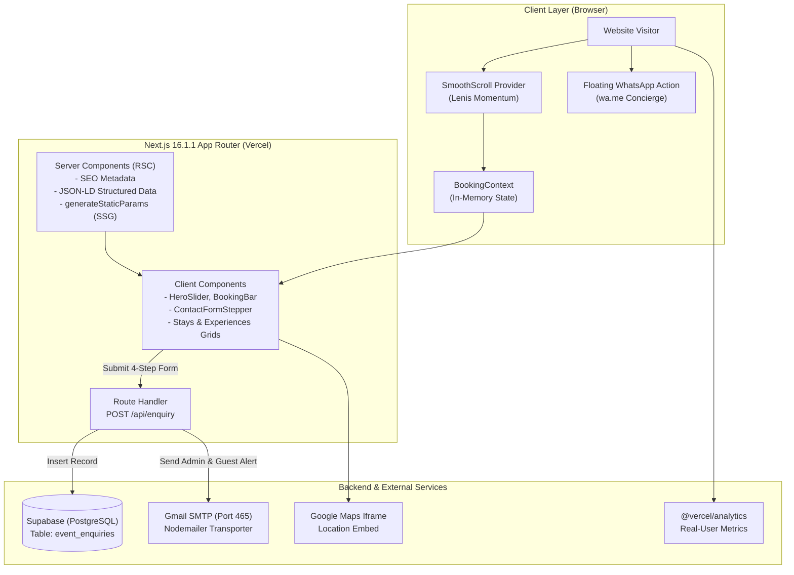

# Vanrai Resort — Senior Engineer Codebase Documentation

> Complete, verified technical documentation of the **Vanrai Resort** web application ([https://vanrairesort.com](https://vanrairesort.com)) based on source code analysis.

---

## 1. Documentation Index

The complete documentation is structured into modular phase guides:

- [01-overview.md](file:///d:/APP/Vanrai-Updated/docs/01-overview.md): **Project Overview & Folder Structure** *(Phases 1–2)*
  - Purpose, target audience, tech stack with exact versions.
  - Grouped dependency audit, script definitions, configuration files (`next.config.ts`, `tsconfig`, etc.).
  - Full annotated directory tree, naming conventions, and RSC Server/Client split.
- [02-routes-and-ui.md](file:///d:/APP/Vanrai-Updated/docs/02-routes-and-ui.md): **Routing & UI Components** *(Phases 3–4)*
  - Route matrix of all 18 routes with metadata, JSON-LD, data sources, and rendering modes.
  - Layouts, templates, error boundaries, and 404 handler.
  - Component breakdown across `components/ui/`, `components/stays/`, and `components/membership/`.
  - Design system, typography (General Sans), OKLCH color tokens, and dead component audit.
- [03-data-and-logic.md](file:///d:/APP/Vanrai-Updated/docs/03-data-and-logic.md): **Data, Content Layer & Business Logic** *(Phases 5–6)*
  - Single sources of truth vs. duplicated values audit.
  - End-to-end room booking journey and state volatility analysis.
  - Pricing, night calculations, and extra guest fee logic.
  - 4-step event planning wizard with field-level validation and payload preparation.
- [04-backend-and-env.md](file:///d:/APP/Vanrai-Updated/docs/04-backend-and-env.md): **Backend, APIs, Integrations & Environment** *(Phases 7–8)*
  - REST route handler `POST /api/enquiry` input/output and error handling.
  - Nodemailer Gmail SSL (port 465) email delivery system and responsive HTML templates.
  - Supabase database schema (`public.event_enquiries`), indexes, and RLS policies.
  - Security audit (input validation, email HTML injection risk, rate limiting).
  - Environment variable master table and production Vercel configuration checklist.
- [05-seo-perf-deploy.md](file:///d:/APP/Vanrai-Updated/docs/05-seo-perf-deploy.md): **SEO, Performance & Deployment Operations** *(Phases 9–11)*
  - Sitemap, robots.txt, canonicalization, and structured data (`LodgingBusiness`, `AboutPage`, `BreadcrumbList`).
  - Next.js image optimization, AVIF/WebP formats, and font loading.
  - Diagnostics report: TypeScript (`tsc --noEmit` passed with 0 errors) vs. ESLint (18 errors, 60 warnings).
  - Turbopack production build report (41 static routes, 1 dynamic route).
  - Vercel deployment instructions, DNS notes, maintenance runbooks, and git status.
- [06-risks-and-todo.md](file:///d:/APP/Vanrai-Updated/docs/06-risks-and-todo.md): **Risks, Technical Debt & Prioritized Roadmap** *(Phase 12)*
  - Analysis of simulated flows (room booking, mock OTP, mock payment, mock membership).
  - Critical security, SEO, and maintainability concerns.
  - Prioritized engineering roadmap (High, Medium, Low) with effort estimates.

---

## 2. One-Page Executive Summary

Vanrai Resort is a luxury agro-tourism web application built with **Next.js 16.1.1 (App Router)**, **React 19.2.3**, and **Tailwind CSS v4**, deployed on **Vercel** with canonical production domain `https://vanrairesort.com`. The site serves to market a 2.5-acre countryside retreat in Ahmednagar, Maharashtra, featuring luxury teak-wood cottages, Deluxe AC rooms, swimming pools, water slides, organic dining, and event celebration lawns accommodating over 500 guests.

### Core Architectural Findings:
1. **Hybrid Lead Generation vs. Mock Booking:**
   - **Event Enquiries (Real & Operational):** The 4-step event planning form on the homepage and `/contact` is fully connected to a production backend. Submissions are persisted into **Supabase Postgres** (`event_enquiries` table) and trigger dual branded HTML notification emails to both the resort admin and the customer via **Nodemailer Gmail SMTP (port 465)**.
   - **Room Reservations (Simulated):** In contrast, the room booking funnel (`/availability` $\rightarrow$ `/booking/details` $\rightarrow$ `/booking/payment` $\rightarrow$ `/booking/confirmation`) is a **frontend simulation**. Payments are simulated via a 2-second timer without calling Razorpay or Stripe, guest details are not persisted to a database, and no confirmation email is dispatched.
2. **Modern Server-Page / Client-Component Split:**
   - Across all 17 public routes, `page.tsx` acts as a Server Component handling SEO metadata, JSON-LD structured data, and build-time static generation (`generateStaticParams` for 13 experiences and 4 event categories). Interactive UI state is delegated to matching `<route>-client.tsx` components.
3. **Performance & Typography:**
   - The application enforces a consistent dark luxury aesthetic centered around `#0a0a0a` charcoal, emerald green (`#00c97b`), and local **General Sans** typography (12 OTF weights with zero external Google Fonts network calls). Smooth momentum scrolling is powered by **Lenis** with body scroll-locking for mobile sheets.
4. **Code Quality & Diagnostics:**
   - `npx tsc --noEmit` compiles cleanly with **0 TypeScript errors**.
   - `npm run build` compiles in **3.6 seconds**, pre-rendering 41 static routes.
   - `npm run lint` reports **18 errors and 60 warnings**, mostly tied to React 19 `useEffect` state synchronization and `@typescript-eslint/no-explicit-any`.

---

## 3. High-Level System Architecture Diagram



---

## 4. End-to-End User Journeys Diagram

```mermaid
flowchart TD
    subgraph Flow1 ["Flow 1: Room Booking Journey (Simulated)"]
        A1["Hero / Stays BookingBar"] -->|Input Dates & Guests| B1["/availability<br/>(Room Inventory & Add-ons)"]
        B1 -->|Select Rooms| C1["/booking/details<br/>(Guest Info & Mock OTP '1234')"]
        C1 -->|Continue| D1["/booking/payment<br/>(Simulated 2s Timer)"]
        D1 -->|Success| E1["/booking/confirmation<br/>(Confetti Burst & Random VR-ID)"]
        E1 -.->|No DB Write / No Email| F1["In-Memory State Reset on Refresh"]
    end

    subgraph Flow2 ["Flow 2: Event Planning Enquiry (Operational)"]
        A2["Homepage / Contact Form"] -->|Step 1: Contact Details| B2["Step 2: Occasion & Dates"]
        B2 -->|Step 3: Pax & Rooms| C2["Step 4: Review & Submit"]
        C2 -->|POST /api/enquiry| D2["Backend API Validation"]
        D2 -->|Insert Row| E2[("Supabase DB")]
        D2 -->|Dispatch Emails| F2["Gmail SMTP"]
        F2 --> G2["Admin Alert + Customer Thanks"]
        D2 -->|Return JSON| H2["Success Screen + WhatsApp Action"]
    end

    subgraph Flow3 ["Flow 3: VIP Membership (WhatsApp Concierge)"]
        A3["/membership Page"] -->|Review Plans (₹20k / ₹30k)| B3["Click Join Button"]
        B3 -->|Direct WhatsApp Link| C3["Chat with Sales Desk"]
    end
```
